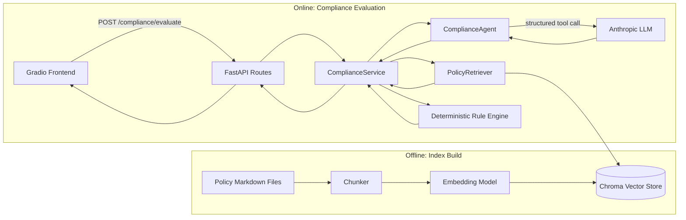

# Bank Credit Policy Compliance Agent

A retrieval-augmented generation (RAG) system that helps commercial loan officers check a loan
application against internal credit policy documents before approval, with a deterministic
rule-engine cross-check to reduce reliance on LLM arithmetic.

## Problem Statement

Loan officers must cross-reference complex, frequently-updated internal credit policies (which
themselves implement central-bank regulatory guidance) before approving business loans. Missing a
clause — an LTV cap, an unsecured lending limit, a required document — can lead to regulatory
penalties or non-performing assets. This project automates that cross-reference step.

## Motivation

Treating this as "ask an LLM whether a loan is compliant" is unsafe: LLMs are unreliable at exact
arithmetic and can misstate thresholds. This project instead grounds every decision in retrieved
source text and independently *recomputes* the numeric thresholds (LTV ratio, unsecured cap) in
plain Python, so the LLM's role is narrowed to synthesis and citation rather than arithmetic.

## Key Features

- Structured ingestion of policy markdown documents into retrievable, metadata-rich chunks
- Local, reproducible embeddings (sentence-transformers) and a persistent Chroma vector index
- Borrower-type-filtered semantic retrieval
- LLM-generated verdicts via **forced structured tool use** (Anthropic), grounded strictly in
  retrieved context
- A **deterministic rule engine** that independently recomputes LTV / unsecured-cap compliance
  from the same retrieved metadata, and overrides the LLM when they disagree
- A retrieval evaluation harness (Recall@k, MRR) against a hand-labeled query set
- FastAPI backend with clean layering (API / service / LLM / retrieval / ingestion)
- Gradio frontend for loan officers

## Architecture



## System Workflow

1. **Index build (offline):** `scripts/build_index.py` parses each policy markdown file into
   section-level chunks (each carrying structured YAML metadata: `max_ltv_ratio`,
   `max_unsecured_loan_lakhs`, `min_credit_score`, `required_documents`), embeds the narrative
   text, and upserts into a persistent Chroma collection.
2. **Request:** A loan officer submits borrower type, loan amount, collateral type, and (optionally)
   collateral value via the Gradio UI.
3. **Retrieval:** `PolicyRetriever` embeds the query and retrieves the top-k policy chunks filtered
   by `borrower_type`.
4. **Generation:** `ComplianceAgent` sends the retrieved context to Claude with a forced tool call
   (`emit_compliance_verdict`), requiring a structured decision, cited section IDs, rationale, and
   confidence — the model is instructed to never invent thresholds not present in context.
5. **Deterministic cross-check:** `ComplianceService` independently computes LTV (`loan_amount /
   collateral_value`) or checks the unsecured cap against the same retrieved metadata, entirely in
   Python — no LLM arithmetic involved.
6. **Reconciliation:** If the rule engine finds a definitive breach, it overrides the LLM's decision
   to `NON_COMPLIANT`. If the rule engine passes but the LLM raises a qualitative concern (e.g.
   missing documentation), the result is downgraded to `REVIEW_REQUIRED` rather than silently
   trusting either side.

## AI/ML/GenAI Methodology

- **Retrieval:** dense semantic search (`all-MiniLM-L6-v2`) with metadata filtering on borrower type
- **Structured outputs / tool calling:** the LLM cannot return free-form text; it must populate a
  JSON schema (`decision`, `cited_section_ids`, `violated_section_ids`, `rationale`, `confidence`)
- **Hallucination mitigation:** (a) the LLM is instructed to cite only provided context and default
  to `REVIEW_REQUIRED` on ambiguity; (b) all numeric compliance facts are independently recomputed
  and take precedence over the LLM's decision
- **Observability:** every LLM call logs input/output token counts and latency; every response
  reports its own latency and confidence
- **Reliability:** LLM calls are wrapped with exponential-backoff retries on transient API errors
- **Evaluation:** a labeled query→expected-section_id dataset drives Recall@k / MRR measurement of
  the retriever, decoupled from generation quality

## Technology Stack

| Layer          | Technology                                  |
|----------------|----------------------------------------------|
| API            | FastAPI, Uvicorn, Pydantic v2                 |
| Retrieval      | ChromaDB (persistent), sentence-transformers  |
| LLM            | Anthropic Messages API (structured tool use)  |
| Reliability    | tenacity (retry/backoff)                      |
| Frontend       | Gradio                                        |
| Testing        | pytest, FastAPI TestClient                    |

## Project Structure

See the top-level tree in this repository; layers are: `app/ingestion` → `app/retrieval` →
`app/llm` → `app/services` → `app/api`, with `app/evaluation` and `tests/` cutting across all
layers, and `frontend/` as an independent client of the API.

## Setup Instructions

```bash
git clone <your-repo-url>
cd credit-policy-compliance-agent
python -m venv .venv && source .venv/bin/activate
pip install -r requirements.txt
cp .env.example .env
# edit .env and set ANTHROPIC_API_KEY
```

## Environment Variables

See `.env.example` for the full list: `ANTHROPIC_API_KEY`, `ANTHROPIC_MODEL`,
`CHROMA_PERSIST_DIR`, `CHROMA_COLLECTION_NAME`, `EMBEDDING_MODEL_NAME`, `POLICY_DATA_DIR`,
`TOP_K_RETRIEVAL`, `API_HOST`, `API_PORT`, `BACKEND_URL`, `LOG_LEVEL`.

## Running Locally

```bash
# 1. Build the vector index from the sample policy documents
python scripts/build_index.py --reset

# 2. Start the API
uvicorn app.api.main:app --reload --port 8000

# 3. In a separate terminal, start the frontend
python frontend/app.py
```

## API Usage

```bash
curl -X POST http://localhost:8000/api/v1/compliance/evaluate \
  -H "Content-Type: application/json" \
  -d '{
        "borrower_type": "MSME",
        "loan_amount_lakhs": 60,
        "collateral_type": "Commercial property",
        "collateral_value_lakhs": 100
      }'
```

Interactive API docs are available at `http://localhost:8000/docs` (FastAPI's auto-generated
OpenAPI/Swagger UI).

## Testing

```bash
pytest -v
```

Tests cover chunker parsing/error-handling, retriever filtering behavior (via fakes), the
rule/LLM reconciliation logic (via fakes — no network calls), and API contract behavior
(via `TestClient` with dependency overrides). No test requires network access or an API key.

## Evaluation Methodology

```bash
python -m app.evaluation.retrieval_eval
```

Reports Recall@k and Mean Reciprocal Rank against a hand-labeled query→section_id dataset
(`app/evaluation/eval_dataset.py`), measuring retrieval quality independently of generation.

## Limitations

- The sample policy corpus is illustrative, not real RBI/central-bank text; a production system
  would need a governed ingestion pipeline for official regulatory sources with version tracking.
- The rule engine currently checks LTV and unsecured caps only; it does not verify document
  completeness or minimum credit score numerically.
- No authentication/authorization layer; not suitable for production deployment as-is.
- Single-LLM-provider design; no fallback model if Anthropic's API is unavailable.

## Future Improvements

- Add document-completeness verification (checklist matching against `required_documents`)
- Add a second rule check for `min_credit_score`
- Add an LLM-as-judge evaluation harness for rationale quality, not just retrieval
- Add authentication and per-officer audit logging of every compliance decision
- Add a fallback LLM provider and circuit breaker for provider outages